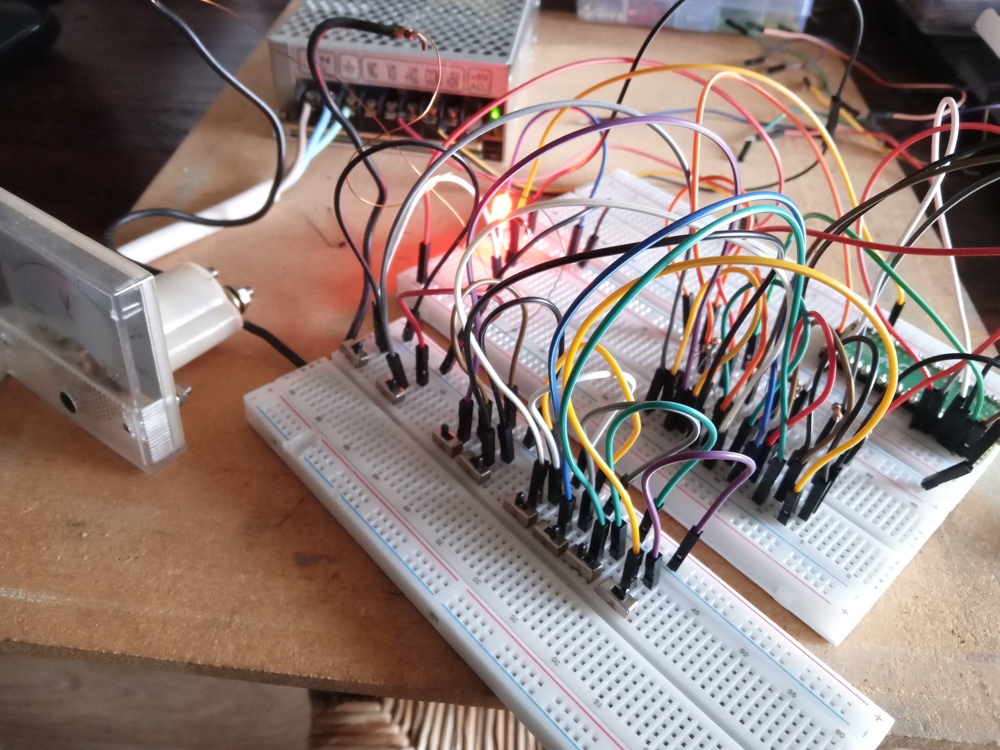
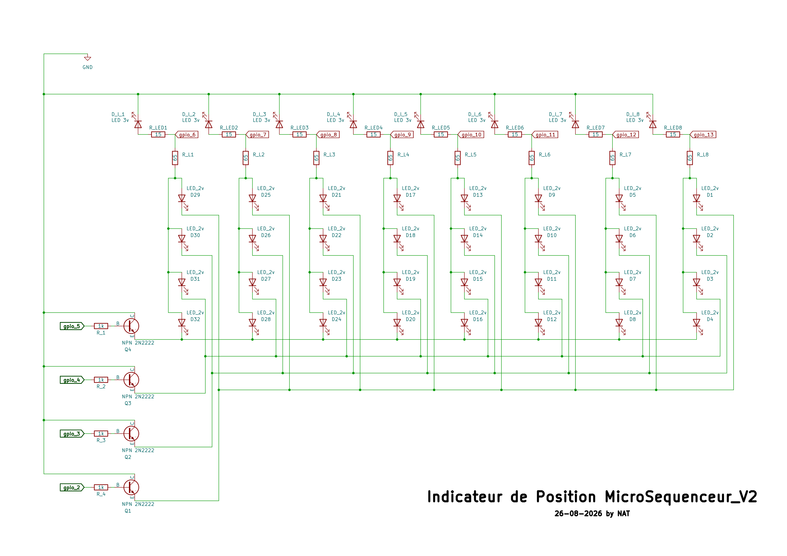

# MicroSequenceur_V2
MicroSequenceur_V2 est une amélioration de MicroSequenceur.
Créer pour un raspberry pico, sur le modél Eurorack pour offrir un maximum de polyvalance.
Par défaut une plage allant de 60 a 260 bpm et une sync-in/sync-out pour le rendre compatible avec d'autres sequenceurs ou autres instruments.
Ce sequenceur repose sur le systéme d'une matrice de 8 line avec du 1/1t, 1/2t et 1/4t.
Posséde une Attack modulable.

Sous license CC-BY-NC-SA

## Instalation

### 1)    Liste des composants :
* Raspberry Pico ou équivalent supportant MicroPython
* 64 interrupteurs
* 15 transistor NPN 2N904
* 4 transistor NPN 2N2222
* 19 résistance 1K Ohm
* 2 potentiomètre 
* 1 LED 3v indicateur BPM
* 8 LED 3v indicateur Line
* 32 LED 2v
* 9 résistance 15 Ohm
* 8 résistance 65 Ohm

### 2)    Firmware :
MicroPython installer sur la carte

### 3)    Branchement :
->Se référencer au schéma [Schema pdf](Microsequenceur_V2.pdf)

Line_1:

vérifiez que le circuit soit correct avec le fichier test [test_line.py](TEST/test_line.py) et [test_line_complite.py](TEST/test_line_complite.py) pour la condition semi-réel

indicateur de position:
[schéma pdf](DOC/26-08-26LED_Indicator-REV1.pdf)

vérifiez que le circuit soit correct avec le fichier test [test_line_complite.py](TEST/test_line_complite.py)
## Utilisation
Polyvalente pour Modular System
